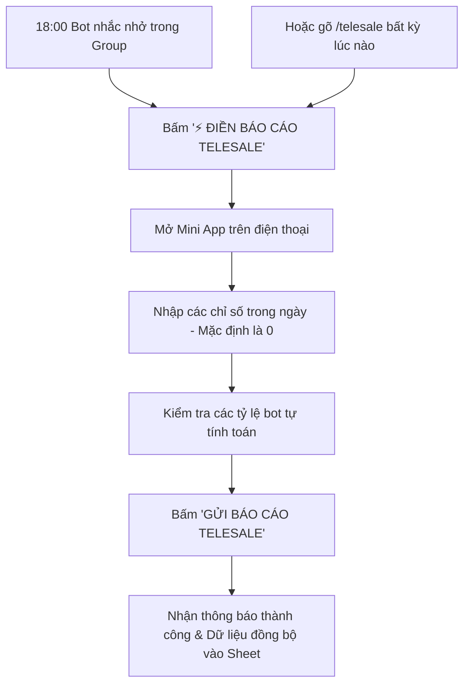

# BẢNG HƯỚNG DẪN VẬN HÀNH & SỬ DỤNG HỆ THỐNG BÁO CÁO TELESALE

> **Hệ thống:** Telegram Mini App KPI & Attendance System  
> **Bot Telegram:** `@baocao_kpi_adsup_bot`  
> **Bộ phận áp dụng:** Nhóm Telesale (`bot_role = 'telesale'`)  
> **Cập nhật:** 2026

---

## I. THÔNG TIN CHUNG VỀ BOT

| Thông tin | Chi tiết |
| :--- | :--- |
| **Username Bot** | `@baocao_kpi_adsup_bot` |
| **Tên hiển thị** | `baocao_kpi_adsup_bot` |
| **ID Bot** | `8868699270` |
| **Link chat trực tiếp** | [t.me/baocao_kpi_adsup_bot](https://t.me/baocao_kpi_adsup_bot) |
| **Link Mini App** | [t.me/baocao_kpi_adsup_bot/app](https://t.me/baocao_kpi_adsup_bot/app) |
| **Đồng bộ dữ liệu** | PostgreSQL + Tự động ghi nhận tức thì vào Google Sheets |

---

## II. HƯỚNG DẪN DÀNH CHO NHÂN VIÊN TELESALE

### 1. Quy Trình Nộp Báo Cáo Hàng Ngày



### 2. Các Bước Thao Tác Chi Tiết

#### Bước 1: Mở Form Báo Cáo
Có 2 cách để mở form:
- **Cách 1 (Khuyên dùng):** Lúc **18:00**, Bot sẽ tự động gửi thông báo vào nhóm Telesale. Nhân viên chỉ cần nhấn vào nút **`⚡️ ĐIỀN BÁO CÁO TELESALE`**.
- **Cách 2:** Gõ lệnh `/telesale` hoặc `/baocao_tele` trong nhóm chat hoặc gửi tin nhắn riêng cho Bot `@baocao_kpi_adsup_bot`.

#### Bước 2: Điền Số Liệu (Giao diện tối ưu Mobile, mỗi mục 1 dòng)
Tất cả các ô ban đầu đều mặc định là **`0`**. Nhân viên chỉ cần chạm vào ô số và gõ số liệu tương ứng:

| Chỉ số | Ý nghĩa | Cách nhập |
| :--- | :--- | :--- |
| **1. Số data nhận** | Tổng số khách hàng/lead nhận phụ trách trong ngày | Nhập số nguyên (VD: `10`) |
| **2. Lịch hẹn PV Mới** | Số lịch hẹn phỏng vấn phát sinh từ data mới | Nhập số nguyên (VD: `3`) |
| **3. Lịch hẹn PV Cũ** | Số lịch hẹn phỏng vấn phát sinh từ chăm sóc data cũ | Nhập số nguyên (VD: `1`) |
| **4. Khách đi PV hôm nay**| Số lượng khách thực tế đã đến phỏng vấn hôm nay | Nhập số nguyên (VD: `2`) |
| **5. Khách nợ tiền cọc** | Số lượng khách còn nợ tiền cọc | Nhập số nguyên (VD: `0`) |
| **6. Khách nợ tiền tour**| Số lượng khách còn nợ tiền tour | Nhập số nguyên (VD: `0`) |
| **7. Doanh số hôm nay** | Doanh thu chốt được trong ngày (VNĐ) | Nhập số tiền (VD: `15000000`) |

#### Bước 3: Xem Chỉ Số Tự Động Tính (Không cần tự tính tay)
Hệ thống sẽ tự động cập nhật ngay trên màn hình:
* **Tổng lịch hẹn hôm nay:** `= Lịch mới + Lịch cũ`
* **Tỷ lệ lịch / Data:** `(Tổng lịch / Số data) × 100%`
  * ⚠️ *Cảnh báo nếu tỷ lệ < 25%*
* **Tỷ lệ tới / Data:** `(Khách đi PV / Số data) × 100%`
  * 🔴 *Cảnh báo yếu nếu < 15%*
  * 🌟 *Đạt chuẩn thưởng nếu > 19%*
* **Tỷ lệ tới / Doanh số:** `Doanh số / Khách đi PV`

#### Bước 4: Gửi Báo Cáo
- Bấm nút **`GỬI BÁO CÁO TELESALE`**.
- Hệ thống thông báo thành công và ghi nhận vào cơ sở dữ liệu.
- *Lưu ý:* Nếu trong ngày nhập nhầm hoặc có số liệu phát sinh trước **19:00**, nhân viên chỉ cần mở lại form, chỉnh sửa số và bấm Gửi lại để ghi đè cập nhật.

---

## III. QUY ĐỊNH THỜI GIAN & CHẾ TÀI PHẠT TỰ ĐỘNG

| Mốc thời gian | Sự kiện | Chi tiết xử lý |
| :---: | :--- | :--- |
| **18:00** | **Nhắc nộp báo cáo** | Bot gửi thông báo nhắc nhở tự động kèm nút mở Mini App vào nhóm. |
| **19:00** | **HẠN CHÓT (DEADLINE)** | Hạn cuối cùng để nộp hoặc cập nhật lại báo cáo ngày. |
| **19:01** | **Quét phạt tự động** | Hệ thống tự động kiểm tra danh sách nhân sự Telesale:<br>• Nếu **đã nộp**: Hợp lệ.<br>• Nếu **chưa nộp**: Hệ thống đối chiếu bảng lịch làm việc & đơn nghỉ phép. Nếu không có lịch OFF hoặc phép duyệt hợp lệ ➔ **Tự động phạt 50.000 VNĐ** vào hệ thống kỷ luật `tk_penalties`. |
| **19:01** | **Tổng kết ngày** | Bot tự động gửi bảng tổng hợp doanh số và tỷ lệ chuyển đổi của toàn đội vào nhóm. |

---

## IV. HƯỚNG DẪN DÀNH CHO QUẢN LÝ / TRƯỞNG NHÓM

### 1. Xem Báo Cáo Tức Thì Bằng Lệnh Telegram
Bất kỳ lúc nào trong ngày, Quản lý có thể gõ lệnh sau vào nhóm Telesale:
* `/tongket_tele`: Bot sẽ tính toán tức thì và trả về danh sách chi tiết:
  * Ai đã nộp, ai chưa nộp.
  * Tổng số data, tổng lịch hẹn, số khách đã tới.
  * Tổng doanh thu đạt được trong ngày của toàn nhóm.

### 2. Kiểm Tra Trên Google Sheets
* Dữ liệu sau khi nhân viên nộp sẽ tự động đồng bộ vào Spreadsheet:
  * **Tab Tổng Hợp:** Lưu toàn bộ dòng báo cáo theo từng ngày của tất cả nhân sự.
  * **Tab Cá Nhân:** Lưu bảng theo dõi luỹ kế của từng Telesale để theo dõi hiệu suất cá nhân cả tháng.

---

## V. HƯỚNG DẪN DÀNH CHO KỸ THUẬT / QUẢN TRỊ VIÊN (IT ADMIN)

### 1. Khởi Động & Vận Hành Hệ Thống
Chạy PowerShell tại thư mục dự án `telegramReport/`:

```powershell
# Chạy bằng script có sẵn
.\scripts\windows\start.ps1

# Hoặc quản lý trực tiếp bằng PM2
pm2 status                    # Xem trạng thái các tiến trình
pm2 restart all               # Khởi động lại toàn bộ
pm2 logs timekeep-bot         # Xem log hoạt động của Bot Telegram
pm2 logs kpi-api              # Xem log của Express API
```

### 2. Danh Sách 3 Tiến Trình Đang Chạy
1. **`kpi-api` (Port 3001):** Cung cấp API Bootstrap nạp dữ liệu và API tiếp nhận Submit báo cáo.
2. **`timekeep-bot`:** Chạy Telegraf xử lý lệnh, gửi nút Mini App, chạy Cronjob 18:00 (nhắc) và 19:00 (phạt & tổng kết).
3. **`cloudflare-tunnel`:** Đảm bảo kết nối bảo mật HTTPS cho Telegram WebApp.

### 3. Cấu Hình Biến Môi Trường (`.env`)
* `TELEGRAM_BOT_TOKEN`: Token của bot `@baocao_kpi_adsup_bot`.
* `MINI_APP_URL`: URL chạy Mini App (`https://bot.adsup.vn` hoặc tunnel).
* `DATABASE_URL`: Kết nối PostgreSQL cơ sở dữ liệu `telegram_kpi`.
