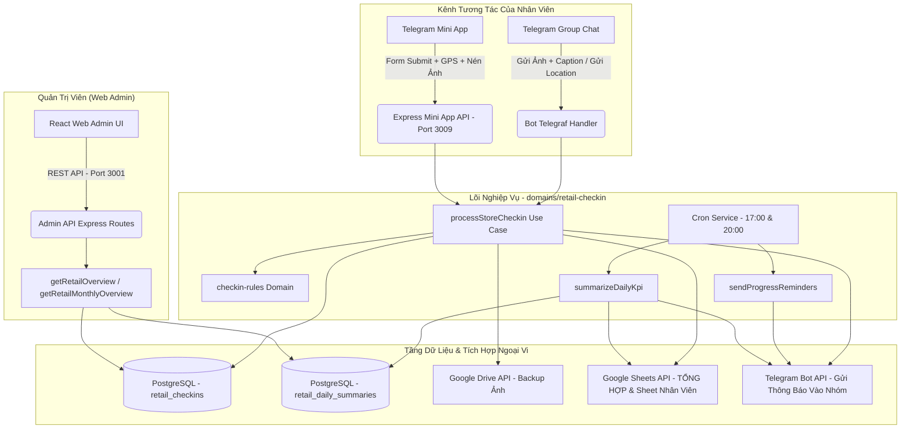

# Kiến Trúc Hệ Thống: Check-in Điểm Bán Thị Trường (Retail Check-in Subsystem)

Tài liệu này mô tả tổng thể kiến trúc, cơ chế vận hành và cách thức tích hợp của phân hệ **Check-in Thị Trường** (`retail_checkin`) trong toàn bộ nền tảng Telegram Report.

---

## 1. Mục Đích Phân Hệ

Phân hệ dành riêng cho đội ngũ nhân viên kinh doanh / phát triển thị trường đi thị trường thực tế:
- **Chỉ tiêu ngày**: Mặc định 15 điểm bán / ngày (có thể điều chỉnh linh hoạt theo nhóm hoặc từng nhân sự).
- **Khung giờ làm việc**: Thứ Hai đến Thứ Bảy, từ **08:30 đến 18:00**. Chủ Nhật được nghỉ (chặn check-in).
- **Minh chứng hợp lệ**: Bắt buộc có ảnh chụp trực tiếp (Selfie trước cổng/biển hiệu + ảnh quầy kệ hàng hóa bên trong).
- **Định vị toạ độ GPS**: Đo toạ độ thời gian thực (vĩ độ, kinh độ, sai số) và sinh liên kết Google Maps tự động.
- **Tự động hóa**:
  - Nhắc nhở tiến độ tự động lúc **17:00** (1 giờ trước khi hết ca).
  - Tự động chốt sổ lúc **20:00** mỗi ngày, đánh dấu `GỬI ĐỦ (ĐẠT)` hoặc `THIẾU` lên Database và Google Sheets.
  - Đồng bộ tức thì lên Google Sheet Tổng và Sheet cá nhân của từng nhân viên.
  - Sao lưu toàn bộ hình ảnh lên Google Drive phân tầng theo nhóm, ngày và mã nhân viên.

---

## 2. Sơ Đồ Kiến Trúc Hệ Thống



---

## 3. Bản Đồ Tệp Nguồn (Source Map)

### A. Tầng Nghiệp Vụ (Business Logic)
- `domains/retail-checkin/index.js`: Cổng vào duy nhất khởi tạo toàn bộ module.
- `domains/retail-checkin/domain/checkin-rules.js`: Luật nghiệp vụ (khung giờ, chỉ tiêu, chống spam 120s, bóc tách tin nhắn).
- `domains/retail-checkin/domain/retail-messages.js`: Bản mẫu tin nhắn HTML thông báo vào nhóm.
- `domains/retail-checkin/application/process-store-checkin.js`: Bộ điều phối chính khi phát sinh một lượt check-in.
- `domains/retail-checkin/application/summarize-daily-kpi.js`: Xử lý chốt sổ 20:00.
- `domains/retail-checkin/application/send-progress-reminders.js`: Gửi nhắc nhở tiến độ 17:00.

### B. Tầng Cơ Sở Dữ Liệu & Google Sheet
- `domains/retail-checkin/infrastructure/postgres/retail-repository.js`: Tương tác với PostgreSQL.
- `domains/retail-checkin/infrastructure/google-sheet/retail-sheet.js`: Đồng bộ bảng tính Google Sheets với định dạng hyperlink toạ độ GPS.
- `packages/database/migrations/v37...v41`: Tập hợp các script migration DB.

### C. Giao Diện Người Dùng
- `apps/bot/public/retail_checkin.html`: File HTML shell cho Mini App.
- `apps/bot/public/retail/theme.css`: Toàn bộ CSS giao diện Mini App.
- `apps/bot/public/retail/gps-service.js`: Module xử lý định vị GPS.
- `apps/bot/public/retail/app.js`: Logic tương tác, nén ảnh, xử lý tab và API call của Mini App.
- `apps/web-admin/src/features/retail/`: Giao diện quản trị trên Web Admin.

---

## 4. Kiểm Thử & Đảm Bảo Chất Lượng

Toàn bộ phân hệ có bộ kiểm thử tự động đạt 100% độ bao phủ chức năng:

```bash
npm run test:retail-checkin
```
